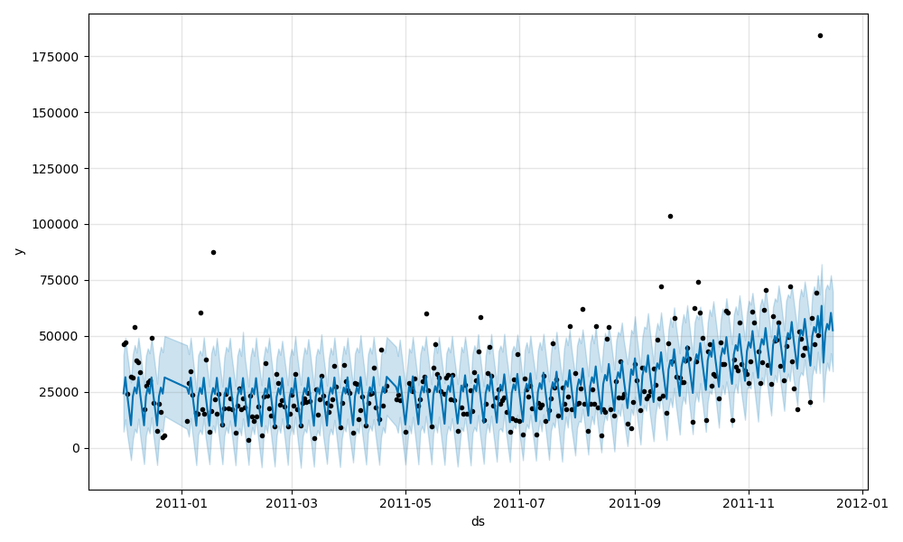

# E-Commerce Daily Sales Forecasting

## Problem Statement  
Predict daily sales for the next 7 days using historical transaction data from a UK-based online retailer.

## Dataset  
- Source: Kaggle – UK Online Retail  
- Time Period: December 1, 2010 to December 9, 2011  
- Fields: InvoiceNo, StockCode, Description, Quantity, InvoiceDate, UnitPrice, CustomerID, Country

## Data Preprocessing  
- Removed rows with missing CustomerID  
- Filtered out negative Quantity and UnitPrice values  
- Calculated Revenue as Quantity × UnitPrice  
- Aggregated total daily revenue

## Forecasting Approach  
- Model used: Facebook Prophet  
- Trained on daily revenue data  
- Selected for its support for trend and seasonality modeling with minimal configuration

## Insights  
- Weekly seasonality observed, with higher sales on weekdays and lower sales on weekends  
- Sales spikes before holidays  
- Model predicts stable revenue in the next week with a slight mid-week increase

## Forecast Output  
The forecasted sales for the next 7 days have been visualized and saved as a plot.

